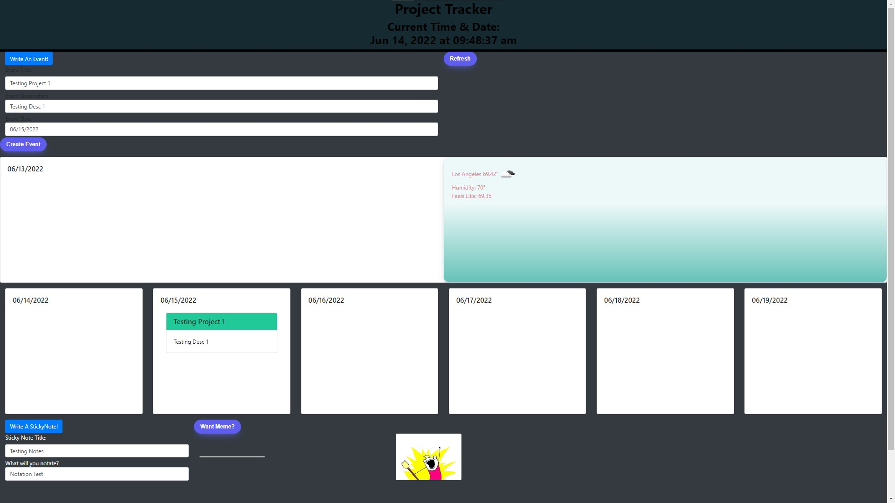

# TheOneCal
One calendar to rule them all

## Purpose of Application
This application helps the user stay organized by saving events for each day of the week. The application will run in the browser and feature updated HTML and CSS and is powered by jQuery.code.

## Description
A calendar application that allows the user to save events for each day of the week. The current day of the week will be highlighted for the user to see more clearly. There are memes as well to hopefully brighten any mood the user may be in with a single click of a button. Lastly, there is a sticky notes button so the user may decide if they need someonething to remember on the side that may not make it to the event category.

## User Story
AS AN employee with a busy schedule
I WANT to add important events to a weekly planner
SO THAT I can manage my time efficiently 

## Acceptance Criteria
GIVEN I am using a weekly planner to create a schedule
WHEN I open the planner
THEN the current day is highlighted
WHEN I scroll down
THEN I am presented with each day of the week
WHEN I view the time blocks for that day
WHEN I click into the "create event button"
THEN I can enter an event

## Mock-Up
The following image shows the application functionality:

    

## Built With
* HTML
* CSS
* JavaScript
* Jquery
* Bootstrap
* moment.js library for Date and Time

## Website
